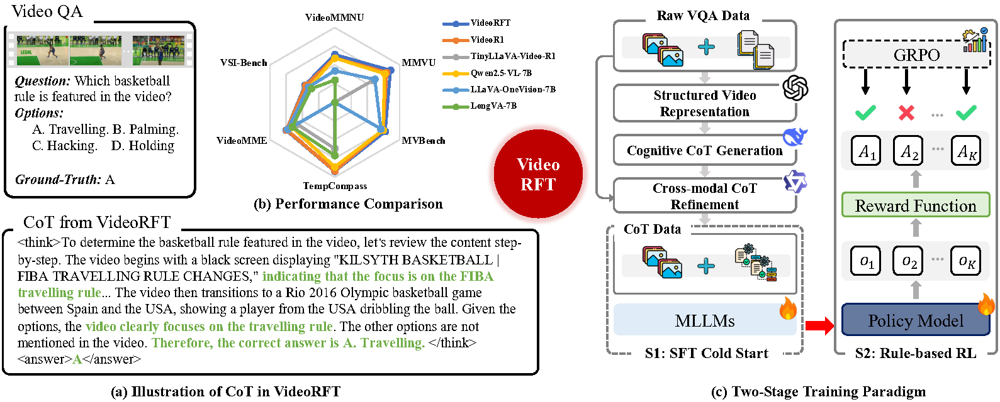
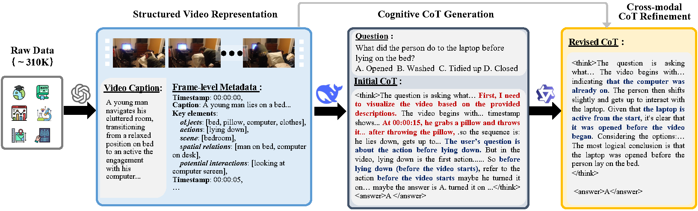
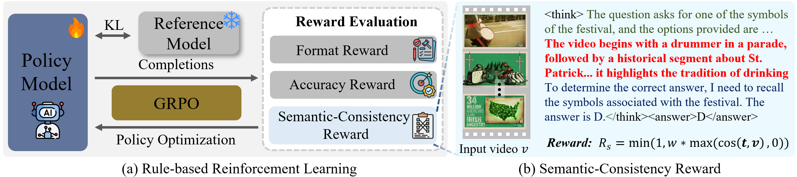
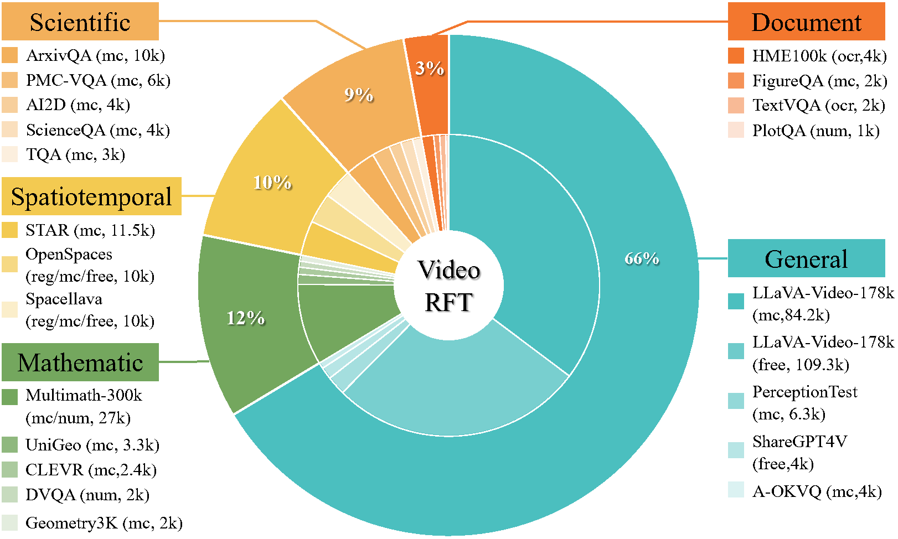

# 🎥 $\text{VideoRFT}$: Incentivizing Video Reasoning Capability in MLLMs via Reinforced Fine-Tuning

<p align="center">
    <!-- </a>&nbsp&nbsp⭐️ <a href="https://github.com/QiWang98/VideoRFT">Project</a>
    </a>&nbsp&nbsp │ &nbsp&nbsp📑 <a href="https://github.com/QiWang98/VideoRFT">ArXiv</a> -->
    </a>&nbsp&nbsp📖 <a href="https://arxiv.org/abs/2505.12434">ArXiv</a>
    </a>&nbsp&nbsp │ &nbsp&nbsp📀 <a href="https://huggingface.co/datasets/QiWang98/VideoRFT-Data">CoT Dataset</a>
    </a>&nbsp&nbsp │ &nbsp&nbsp📀 <a href="https://huggingface.co/datasets/QiWang98/VideoRFT-Data">RL Dataset</a>
    </a>&nbsp&nbsp │ &nbsp&nbsp🤗 <a href="https://huggingface.co/QiWang98/VideoRFT">Models</a>
</p>

<!-- 🚀✨🔧✅📝💡🔍📊📀 -->

## <a id="News"> 📰 News</a>
- [2025/09/19] Our paper has been **accepted to NeurIPS 2025** 🎉! 
- [2025/06/01] We released our 3B Models ([🤗VideoRFT-SFT-3B](https://huggingface.co/QiWang98/VideoRFT-SFT-3B) and [🤗VideoRFT-3B](https://huggingface.co/QiWang98/VideoRFT-3B)) to huggingface.
- [2025/05/25] We released our 7B Models ([🤗VideoRFT-SFT-7B](https://huggingface.co/QiWang98/VideoRFT-SFT) and [🤗VideoRFT-7B](https://huggingface.co/QiWang98/VideoRFT)) to huggingface.
- [2025/05/20] We released our Datasets ([📀CoT Dataset](https://huggingface.co/datasets/QiWang98/VideoRFT-Data) and [📀RL Dataset](https://huggingface.co/datasets/QiWang98/VideoRFT-Data)) to huggingface.
- [2025/05/18] Our paper is released on [ArXiv](https://arxiv.org/abs/2505.12434), and we have open-sourced our code on [GitHub](https://github.com/QiWang98/VideoRFT)!

## <a id="Overview"> 🔎 Overview</a>

Reinforcement fine-tuning (RFT) has shown great promise in achieving humanlevel reasoning capabilities of Large Language Models (LLMs), and has recently been extended to MLLMs. Nevertheless, reasoning about videos, which is a fundamental aspect of human intelligence, remains a persistent challenge due to the complex logic, temporal and causal structures inherent in video data. To fill this gap, we propose $\textbf{VideoRFT}$, a novel approach that extends the RFT paradigm to cultivate human-like video reasoning capabilities in MLLMs. $\textbf{VideoRFT}$ follows the standard two-stage scheme in RFT: supervised fine-tuning (SFT) with chain-of-thought (CoT) annotations, followed by reinforcement learning (RL) to improve generalization. A central challenge to achieve this in the video domain lies in the scarcity of large-scale, high-quality video CoT datasets. We address this by building a fully automatic CoT curation pipeline. First, we devise a cognitioninspired prompting strategy to elicit a reasoning LLM to generate preliminary CoTs based solely on rich, structured, and literal representations of video content. Subsequently, these CoTs are revised by a visual-language model conditioned on the actual video, ensuring visual consistency and reducing visual hallucinations. This pipeline results in two new datasets $-$ VideoRFT-CoT-102K for SFT and VideoRFT-RL-310K for RL. To further strength the RL phase, we introduce a novel semantic-consistency reward that explicitly promotes the alignment between textual reasoning with visual evidence. This reward encourages the model to produce coherent, context-aware reasoning outputs grounded in visual input. Extensive experiments show that $\textbf{VideoRFT}$ achieves state-of-the-art performance on six video reasoning benchmarks.

<div align="center">

</div>

## <a id="Methodology"> ✨ Methodology</a>

To overcome the scarcity of video CoTs, we develop a scalable, cognitively inspired pipeline for high-quality video CoT dataset construction.

<div align="center">

</div>

To further strength the RL phase, we introduce a novel semantic-consistency reward that explicitly promotes the alignment between textual reasoning with visual evidence. 

<div align="center">

</div>


## <a id="Datasets"> 📀 Datasets</a>

Based on above pipeline, we construct two large-scale datasets, i.e., [📀VideoRFT-CoT-102K](https://huggingface.co/datasets/QiWang98/VideoRFT-Data) and [📀VideoRFT-RL-310K](https://huggingface.co/datasets/QiWang98/VideoRFT-Data).
<div align="center">

</div>

## <a id="Setup"> 🛠️ Set up</a>

### Requirements
* `Python >= 3.11`
* `Pytorch >= 2.5.1`
* `transformers == 4.51.3`
* `vLLM == 0.7.3`
* `trl == 0.16.0`

### Installation
```bash
git clone https://github.com/QiWang98/VideoRFT
cd VideoRFT

# Create and activate environment
conda create -n VideoRFT python=3.11 
conda activate VideoRFT
bash setup.sh

# Install decord for improved video processing
cd src/qwen-vl-utils
pip install -e .[decord]
```
<!-- # download training dataset
git lfs install
git clone dataset-url
``` -->

## 🚀 Training

### Supervised Fine-Tuning (SFT)
We begin with supervised fine-tuning on the VideoRFT-CoT dataset for one epoch:

```bash
bash ./src/scripts/run_sft_video.sh
```

This step can be skipped by directly using our pretrained SFT models, available at [🤗VideoRFT-SFT-7B](https://huggingface.co/QiWang98/VideoRFT-SFT) or [🤗VideoRFT-SFT-3B](https://huggingface.co/QiWang98/VideoRFT-SFT-3B).

### Reinforcement Learning (RL)

Next, perform reinforcement learning using the VideoRFT-RL dataset:

```bash
bash ./src/scripts/run_grpo_video.sh
```

To enable faster training via vLLM acceleration:

```bash
bash ./src/scripts/run_grpo_vllm_qwen25vl.sh
```

> **Note:** During training, we adopt the following settings for efficiency:

* **VIDEO PIXELS**: 128 × 28 × 28
* **FPS FRAMES**: 16

All frame-related configurations can be adjusted in `src/qwen-vl-utils`.

## 📈 Inference & Evaluation

> During inference, we increase the maximum frame resolution and length to boost performance:

* **VIDEO PIXELS**: 256 × 28 × 28
* **FPS FRAMES**: 32

You can configure these parameters in `src/qwen-vl-utils`.

> We evaluate all models under a unified decoding configuration following the official Qwen2.5-VL demo:

* `top_p = 0.001`
* `temperature = 0.01`

### Evaluation Procedure

1. Download preprocessed evaluation JSONs from: \[[🤗 eval](https://huggingface.co/datasets/Video-R1/Video-R1-eval)]

2. Download the video data from the official sites of each benchmark and organize them as specified in the JSON files.

3. Run the evaluation across all benchmarks:

```bash
bash ./src/eval_bench.sh
```

## 🙏 Acknowledgements

We gratefully acknowledge the contributions of the open-source community, particularly [DeepSeek-R1](https://github.com/deepseek-ai/DeepSeek-R1), [Open-R1](https://github.com/huggingface/open-r1), and [R1-V](https://github.com/Deep-Agent/R1-V).


## 📚 Citations

If you find this work helpful, please consider citing:

```
@article{VideoRFT,
  title={VideoRFT: Incentivizing Video Reasoning Capability in MLLMs via Reinforced Fine-Tuning},
  author={Wang, Qi and Yu, Yanrui and Yuan, Ye and Mao, Rui and Zhou, Tianfei},
  journal={arXiv preprint arXiv:2505.12434},
  year={2025}
}
```
